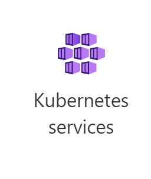

# Installing the Spatial Enrich Dashboard Helm Chart on Azure AKS

## **Before starting**

Make sure you have the following items before starting:
- Access tokens to Docker image registry.
- A subscription that can be used to create Storage account, K8 cluster, file share. 

It is recommended to use a single Azure subscription to complete this tutorial. To make it easier, this tutorial is based on Azure portal and
Azure Cloud Shell (Bash). In order to achieve the best performance, create all resources in the same region.

## Preview
- [Step 1: Prepare your environment](#step-1-prepare-your-environment)
- [Step 2: Create a AKS Cluster ](#step-2-create-k8s-cluster-aks)
- [Step 3: Download Spatial Enrich Dashboard Docker Images](#step-3-download-spatial-enrich-dashboard-docker-images)
- [Step 4: Installation of Spatial Enrich Dashboard Helm Chart](#step-4-installation-of-spatial-enrich-dashboard-helm-chart)

## Step 1: Prepare your environment
To deploy Spatial Enrich Dashboard application in Azure AKS, install the following client tools on you machine:
- [Docker](https://docs.docker.com/engine/install/)
- [Azure CLI](https://learn.microsoft.com/en-us/cli/azure/)

Above tools are required to push docker images to Azure Container Registry.

### Setup Cloud Shell
Login to [Microsoft Azure Portal](https://portal.azure.com/)
\
Open Cloud Shell by clicking on the icon on the toolbar.
\
Verify the following utilities,
```
az version 
```
```
kubectl version 
```
```
helm version 
```


### Clone Spatial Enrich Dashboard helm charts & resources
```
git clone https://github.com/PreciselyData/spatial-enrich-dashboard.git
```

## Step 2: Create K8s Cluster (AKS)

You can create an AKS cluster or use an existing EKS cluster.
-   [2.1 Create an AKS Cluster](#21-create-an-aks-cluster-)
-   [2.2 Connect to AKS Cluster](#22-connect-to-aks-cluster)
Also see:    
[Deploy an Azure Kubernetes Service (AKS) cluster using Azure portal](https://docs.microsoft.com/en-us/azure/aks/kubernetes-walkthrough-portal)  

### 2.1 Create an AKS Cluster 
Default Spatial Enrich Dashboard deployment will need 30 vCPUs + 15GB RAM.
It is good to start from a single node AKS cluster with `F32s_v2` VM. It
has 32 vCPUs + 64GB RAM.

In Azure portal, click on **Kubernetes services** 



Now click on **Create** → **Create a Kubernetes Cluster** 


#### Specify information for cluster


Create a new Resource group `spatial-aks` for this AKS cluster

Kubernetes cluster name -> `spatial32`\
Kubernetes version -> `1.29.2`\
Node size -> Change size -> F32s_v2\
Scale method -> `Manual`\
Node count -> `1`

> NOTE: Create tag if you want to manage resource usage by application tag

Click on **Create the AKS cluster** (It may take some time to get provisioned).

### 2.2 Connect to AKS Cluster

We use Azure Cloud Shell (VM) as a bridge to manage the cluster and move data to the Fileshares. Alternatively, you can use [Azure CLI](https://learn.microsoft.com/en-us/cli/azure/install-azure-cli) on your machine.
\
At the home page of Azure portal, click on the Azure Cloud Shell icon (next to the search field), following the instructions to enable the Bash (you may need to create a storage Fileshares if you are first time using the Cloud Shell).
#### Open Cloud Shell


>NOTE: in the Bash windows, you can use ctrl-c to copy and shift-insert
to paste.


#### Set kubectl context to AKS cluster
In Azure portal, go to

spatial-aks → spatial32,and click on `Connect` to find the commands to add the context to kubectl.


>Note: ``az`` command is bound to a subscription, if the resource group is
not in the current subscription, then need to switch.

Clicking on `Open Cloud Shell` will also run the both az commands automatically and reset the cloud
shell if it was already open


```shell
az account set --subscription 385ad333-7058-453d-846b-xxxxxxxxx
```

```shell
az aks get-credentials --resource-group spatial-aks --name spatial32
```

```shell
kubectl config use-context spatial32
kubectl config current-context

````
Now kubectl is set default to the AKS spatial32 cluster. You can check
the status of the nodes
```shell
kubectl get nodes
```
```shell
NAME                                STATUS   ROLES   AGE    VERSION
aks-agentpool-39271417-vmss000000   Ready    <none>  106s   v1.29.2
```

## Step 3: Download Spatial Enrich Dashboard Docker Images

 Provided docker images need to be pushed to a container registry. You can create Azure Container Registry by following [these](https://learn.microsoft.com/en-us/azure/container-registry/container-registry-get-started-portal?tabs=azure-) steps if you don't have one. Then you can use a script [push-images](../../../scripts/aks/push-images.sh) to push the docker images to container registry.

>Note: Azure Cloud Shell doesn't support docker daemon required by the script, so you have to install **[Docker](https://docs.docker.com/engine/install/)** and **[Azure CLI](https://learn.microsoft.com/en-us/cli/azure/get-started-with-azure-cli)** on your local system.  

Open a shell on you local system and execute the following steps.

Log in to your Azure Container Registry:
```shell
az login
az acr login --name <azure_container_registry>
```

> Note: Unzip the downloaded docker images to a directory <spatial_analytics_docker_images_dir> so that it contains tar file.

Run the shell script to push images to Azure Container Registry:
```shell
cd <spatial_analytics_docker_images_dir>
chmod a+x ~/spatial-enrich-dashboard/scripts/aks/push-images.sh
~/spatial-enrich-dashboard/scripts/aks/push-images.sh <azure_container_registry>.azurecr.io
```
List images in the registry:
\
``az acr repository list --name <azure_container_registry> --output table``

spatial-enrich-dashboard docker images which will be pushed to container registry

## Step 4: Installation of Spatial Enrich Dashboard Helm Chart

Create a secret for pulling image from ACR:
\
Following command gets a token for current user to authenticate against ACR, if you want to use a service principal credentials, refer to [Use Service principal](https://learn.microsoft.com/en-us/azure/container-registry/container-registry-auth-kubernetes).
```shell
kubectl create secret docker-registry regcred \
    --namespace spatial-dashboard \
    --docker-server=[acr_name].azurecr.io \
    --docker-username=00000000-0000-0000-0000-000000000000\
    --docker-password=$(az acr login --name [acr_name] --expose-token --output tsv --query accessToken)
```
To install/upgrade the Spatial Enrich Dashboard helm chart, use the following command:

```shell

cd ~/spatial-enrich-dashboard/

helm install spatial-dashboard ~/spatial-enrich-dashboard/helm/superset \
 -f ~/spatial-enrich-dashboard/helm/superset/values.yaml \
 --set "image.repository=[acr].azurecr.io/spatial-enrich-dashboard" \
 --set "image.tag=latest" \ 
 --set "imagePullSecrets=regcred" \  
 --namespace spatial-dashboard   
```

#### Mandatory Parameters
* ``image.repository``: The ACR repository for Spatial Enrich Dashboard docker image e.g. spatialregistry.azurecr.io
* ``image.tag``: The docker image tag value e.g. 1.2.0 or latest.
* ``imagePullSecrets``: The name of the secret holding Azure Container Registry (ACR)  credential information.

Once you run Spatial Enrich Dashboard helm install/upgrade command, it might take few minutes to get ready for the first time. You can run the following command to check the creation of pods. Please wait until all the pods are in running state:
```shell
kubectl get pods -w --namespace spatial-dashboard 
```

After all the pods in namespace 'spatial-analytics' are in 'ready' status, launch dashboard in a browser with the URL `https://<your external ip>`